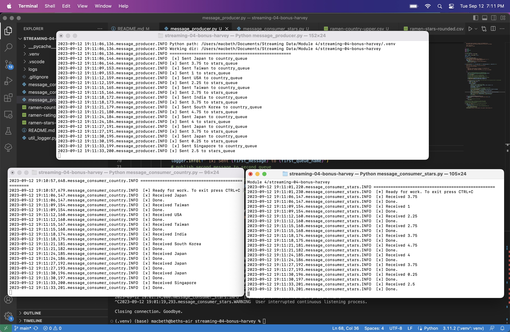

# streaming-04-bonus-harvey

* Beth Harvey
* Streaming Data
* Module 4 Bonus
* September 12, 2023

## Overview

The goal of this project is to practice working with streaming data by creating one producer that sends messages to two different queues which will be received by two different workers. The message for the first queue is the Country column from "ramen-ratings.csv", which the first consumer converts to all uppercase. The original and the uppercase versions are appended as a new row to the "ramen-country-upper.csv" file. The message for the second queue is the Stars column, containing the star rating of that ramen. The second consumer rounds this value to the nearest whole number and writes the original and rounded values to the "ramen-stars-rounded.csv" file.

## Data

The dataset used for this project is a CSV containing data from over 2500 consumer ratings for various types of ramen collected from https://www.theramenrater.com/. The CSV can be found at https://www.kaggle.com/datasets/residentmario/ramen-ratings.

## Prerequisites

1. Git
2. Python 3.7+ (3.11+ preferred)
3. VS Code Editor
4. VS Code Extension: Python (by Microsoft)
5. RabbitMQ Server installed and running locally
6. Virtual Environment
    * `python3 -m venv .venv`
    * `source .venv/bin/activate`
7. Pika
    * `python3 -m pip install pika`

## Running The Code

1. Open three separate terminal windows and navigate to the folder containing this project. 
2. Activate the virtual environment (see step 6 under Prerequisites)
3. Start the "message_consumer_country.py" file in one terminal.
    * `python3 message_consumer_country.py`
4. Start the "message_consumer_stars.py" file in a second terminal.
    * `python3 message_consumer_stars.py`
5. Start the "message_producer.py" file in the third terminal.
    * `python3 message_producer.py`
6. The processes will run until the end of the input file is reached or until the process is manually stopped. This can be done by hitting CTRL + C
7. The messages transmitted will now be in the respective CSV files.

## Screenshot

See a running example with at least 3 concurrent process windows here:

